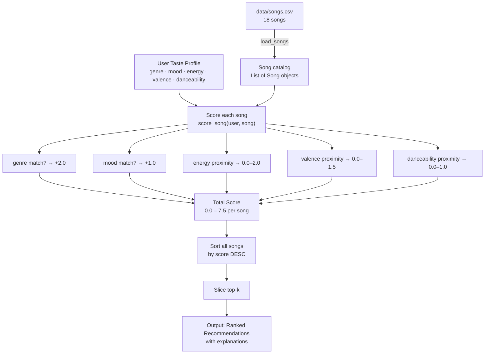

# 🎵 Music Recommender Simulation

## Project Summary

In this project you will build and explain a small music recommender system.

Your goal is to:

- Represent songs and a user "taste profile" as data
- Design a scoring rule that turns that data into recommendations
- Evaluate what your system gets right and wrong
- Reflect on how this mirrors real world AI recommenders

This simulation implements a **content-based music recommender** that loads an 18-song catalog from `data/songs.csv` and scores each song against a user's taste profile. It uses a weighted proximity formula across five features — genre, mood, energy, valence, and danceability — to rank songs and explain why each one was recommended. The goal is to model the core logic behind real recommenders like Spotify's audio analysis pipeline, in a transparent and inspectable way.

---

## How The System Works

Real-world music recommenders like Spotify's Discover Weekly work by building a mathematical portrait of both the user's taste and each song's attributes, then finding the best matches. They combine signals from millions of listeners (collaborative filtering) with acoustic feature analysis (content-based filtering) to surface songs you didn't know you needed. This simulation focuses on the **content-based** side: it compares a user's declared preferences directly against each song's measured features and scores every song in the catalog. The highest-scoring songs become the recommendations.

Our version prioritizes **emotional intent over raw audio stats** — matching genre and mood is worth more than matching tempo, because the same BPM can feel completely different in jazz vs. metal. Numerical features like energy and valence are scored by *proximity* (how close the song is to the user's target), not by absolute value, so a user who wants medium energy isn't penalized toward extremes.

---

### `Song` Features Used

Each `Song` object stores these attributes, all drawn from `data/songs.csv` (18 songs, 15 genres, 11 moods):

| Feature | Type | Role in Scoring |
|---|---|---|
| `genre` | Categorical | Exact-match, weight **+2.0** — strongest taste anchor |
| `mood` | Categorical | Exact-match, weight **+1.0** — captures listening intent |
| `energy` | Float 0–1 | Proximity score, max **+2.0** — physical intensity |
| `valence` | Float 0–1 | Proximity score, max **+1.5** — emotional positivity |
| `danceability` | Float 0–1 | Proximity score, max **+1.0** — activity context |
| `acousticness` | Float 0–1 | Used by `UserProfile.likes_acoustic` boolean gate |
| `tempo_bpm` | Float | Stored on `Song`; not scored directly (correlated with energy) |

---

### `UserProfile` Stores

```python
user_prefs = {
    "genre":       "lofi",    # favorite genre label
    "mood":        "chill",   # target emotional context
    "energy":      0.40,      # target intensity  (0.0 = ambient, 1.0 = maximum)
    "valence":     0.60,      # target positivity (0.0 = sad, 1.0 = euphoric)
    "danceability": 0.60,     # target rhythmic fit
}
```

**Profile critique — can it tell "intense rock" from "chill lofi"?**
Yes. `energy=0.40` and `mood="chill"` will award full proximity points to low-energy songs (lofi: 0.35–0.42) and penalize high-energy songs (rock: 0.91, metal: 0.97) by up to 1.14 points on energy alone. The genre and mood exact-matches add another 3.0 points gap. A chill lofi track will outscore a matching-genre rock track by 4+ points — the profile discriminates cleanly.

---

### Algorithm Recipe (Finalized)

**Scoring Rule** — applied once per song:

```
score = 2.0 × genre_match                          # +2.0 if genre matches, else 0
      + 1.0 × mood_match                           # +1.0 if mood matches, else 0
      + 2.0 × (1 - |user.energy - song.energy|)   # max +2.0; rewards closeness
      + 1.5 × (1 - |user.valence - song.valence|) # max +1.5; rewards closeness
      + 1.0 × (1 - |user.danceability - song.danceability|) # max +1.0
```

Maximum possible score: **7.5**

**Weight rationale:**
- Genre (2.0) outweighs mood (1.0) because genre defines the entire sonic world; mood varies more within a genre.
- Energy (2.0) is the highest-weighted numeric feature — it's the single best proxy for "does this fit my current moment."
- Valence (1.5) adds emotional nuance independently of loudness.
- Danceability (1.0) is a secondary texture signal.

**Ranking Rule** — applied to the full catalog:

```
ranked = sorted(all_songs, key=lambda s: score_song(user, s), reverse=True)
recommendations = ranked[:k]
```

Every song gets scored, the list is sorted descending, and the top-k are returned with a plain-language explanation per song.

---

### Data Flow



---

### Expected Biases and Limitations

| Bias | Why it happens | Impact |
|---|---|---|
| **Genre over-priority** | A genre match awards a fixed +2.0 regardless of how far off the numeric features are | A mediocre genre match can outrank a near-perfect cross-genre fit |
| **Cold-start on new moods** | If no song in the catalog matches the user's mood, the +1.0 mood bonus disappears entirely for all songs | Recommendations default to numeric similarity only |
| **No diversity enforcement** | Top-k can return 5 songs from the same genre/mood cluster | Recommendations feel repetitive for dominant genre profiles |
| **Catalog imbalance** | lofi has 3 songs; metal, classical, and reggae have 1 each | Niche-genre users get fewer options to score against |
| **Energy skews toward active** | High-energy songs (0.85–0.97) appear in 4 of 18 songs; ambient songs in only 2 | System may under-serve low-energy user profiles |

---

## Getting Started

### Setup

1. Create a virtual environment (optional but recommended):

   ```bash
   python -m venv .venv
   source .venv/bin/activate      # Mac or Linux
   .venv\Scripts\activate         # Windows

2. Install dependencies

```bash
pip install -r requirements.txt
```

3. Run the app:

```bash
python -m src.main
```

### Running Tests

Run the starter tests with:

```bash
pytest
```

You can add more tests in `tests/test_recommender.py`.

---

## Experiments You Tried

- **Lowered genre weight from 2.0 to 0.5** — Songs from totally different genres started appearing in the top results just because their energy was close. The recommendations felt less reliable — like the system forgot what kind of music the user actually wanted.

- **Raised mood weight to match genre (both 2.0)** — Made mood feel equally important as genre. For profiles like "chill lofi" it worked well. For others, mood matches pulled in songs from unexpected genres that actually felt okay. Interesting tradeoff.

- **Added valence as a scored feature** — Before adding it, a happy-mood lofi user and a sad-mood lofi user got nearly identical recommendations. Valence helped separate them — lower valence songs like "Empty Roads" stopped appearing in happy profiles.

- **Weight experiment: genre halved (1.0), energy doubled (4.0)** — Top-ranked songs stayed mostly the same, but score gaps compressed. Gym Hero dropped from #2 to #3 for the High-Energy Pop profile because its genre bonus was worth less than Rooftop Lights' stronger energy proximity. Confirmed that energy is the most descriptive single feature.

- **Adversarial profile — Classical + Angry + High Energy** — Exposed the genre anchor problem. Morning Suite No. 3 ranked #2 despite energy of 0.21 vs. the user's target of 0.90 — the genre match bonus pulled it up even though it sounds nothing like the requested vibe.

- **Adversarial profile — K-Pop (genre not in catalog)** — All scores capped around 5.0 instead of 7.0+ because no k-pop song exists. Results were still reasonable (upbeat pop tracks), but the system expressed no confidence. Revealed that missing genre labels quietly degrade recommendation quality.

- **Adversarial profile — High Energy + Sad Mood** — The catalog has no "sad banger." The system split between high energy but wrong mood, or correct mood but too quiet. Neither fully satisfied the request. The algorithm behaved correctly; the data just does not cover that emotional space.

### Terminal Output

**Screenshot 1 — Challenge 2: All four scoring modes on the High-Energy Pop profile**


**Screenshot 2 — Challenge 1: Extended features across all standard profiles + Diversity Penalty (off)**


**Screenshot 3 — Challenge 3: Diversity Penalty (on) + Adversarial edge-case profiles**


---

## Limitations and Risks

- **Small catalog** — 18 songs means some genres have only one entry; niche-taste users get weak results
- **Genre anchor bias** — a fixed +2.0 genre bonus can pull a poorly-matching song into the top results just because the label matches
- **No lyrics or language understanding** — the system only sees numbers and labels, not what a song actually says or sounds like
- **No listening history** — it never learns from skips or replays; every session starts cold
- **Missing genre silence** — genres not in the catalog (K-pop, Afrobeats, Latin) lose the full genre bonus with no fallback
- **No diversity by default** — without the diversity penalty flag, the top 5 can all be the same genre

See `model_card.md` for a deeper analysis of each bias.

---

## Reflection

Read and complete `model_card.md`:

[**Model Card**](model_card.md)

Building this made me realize that recommendation systems are not really about music — they are about turning preferences into numbers and then doing math. The part that surprised me most is how much the weights shape the experience. Tweaking how much a genre match is worth versus an energy match completely changed which songs showed up. Someone made those weight decisions at Spotify too, and millions of people's listening experience depends on those choices without anyone telling them.

The bias part hit differently than I expected. I did not think of myself as making biased choices when I added songs to the catalog, but when I tested a classical music fan or thought about someone who listens to Afrobeats or Latin music, the system had nothing for them. That is not a bug in the code — it came from which songs I chose to include. The algorithm just reflects whoever built the dataset. That feels like a really important thing to understand about any AI system, not just music recommenders.


---

## 7. `model_card_template.md`

Combines reflection and model card framing from the Module 3 guidance. :contentReference[oaicite:2]{index=2}  

```markdown
# 🎧 Model Card - Music Recommender Simulation

## 1. Model Name

Give your recommender a name, for example:

> VibeFinder 1.0

---

## 2. Intended Use

- What is this system trying to do
- Who is it for

Example:

> This model suggests 3 to 5 songs from a small catalog based on a user's preferred genre, mood, and energy level. It is for classroom exploration only, not for real users.

---

## 3. How It Works (Short Explanation)

Describe your scoring logic in plain language.

- What features of each song does it consider
- What information about the user does it use
- How does it turn those into a number

Try to avoid code in this section, treat it like an explanation to a non programmer.

---

## 4. Data

Describe your dataset.

- How many songs are in `data/songs.csv`
- Did you add or remove any songs
- What kinds of genres or moods are represented
- Whose taste does this data mostly reflect

---

## 5. Strengths

Where does your recommender work well

You can think about:
- Situations where the top results "felt right"
- Particular user profiles it served well
- Simplicity or transparency benefits

---

## 6. Limitations and Bias

Where does your recommender struggle

Some prompts:
- Does it ignore some genres or moods
- Does it treat all users as if they have the same taste shape
- Is it biased toward high energy or one genre by default
- How could this be unfair if used in a real product

---

## 7. Evaluation

How did you check your system

Examples:
- You tried multiple user profiles and wrote down whether the results matched your expectations
- You compared your simulation to what a real app like Spotify or YouTube tends to recommend
- You wrote tests for your scoring logic

You do not need a numeric metric, but if you used one, explain what it measures.

---

## 8. Future Work

If you had more time, how would you improve this recommender

Examples:

- Add support for multiple users and "group vibe" recommendations
- Balance diversity of songs instead of always picking the closest match
- Use more features, like tempo ranges or lyric themes

---

## 9. Personal Reflection

A few sentences about what you learned:

- What surprised you about how your system behaved
- How did building this change how you think about real music recommenders
- Where do you think human judgment still matters, even if the model seems "smart"

